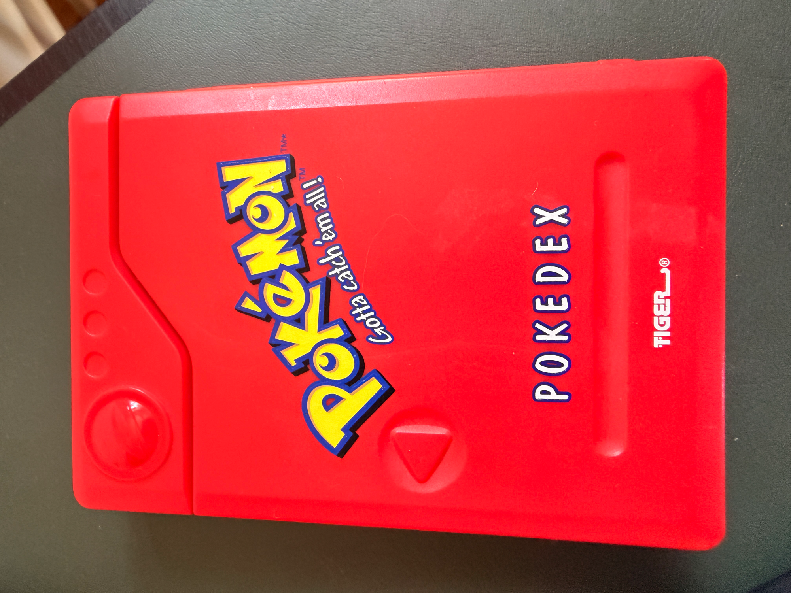
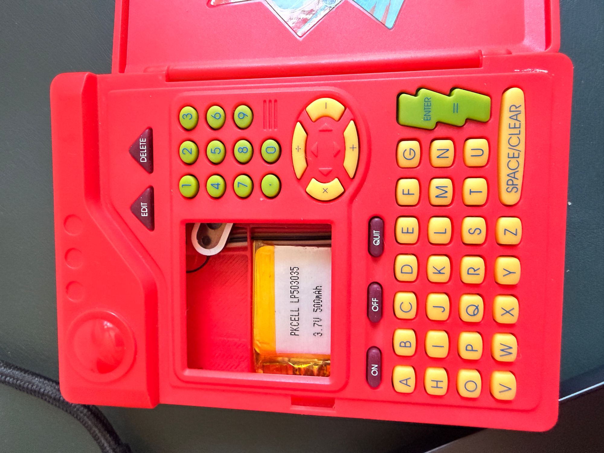
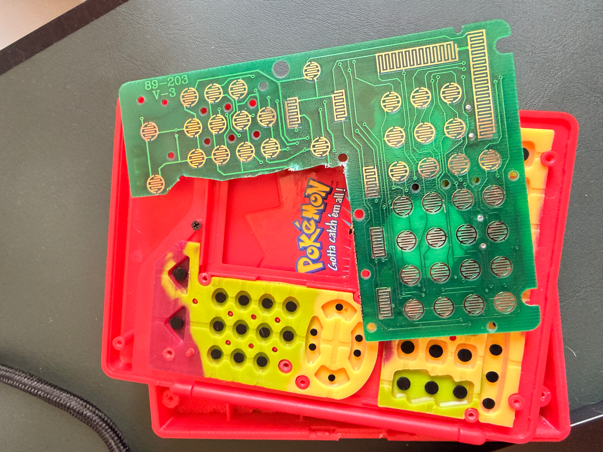

# Pokédex

A software revival of the 1999 Tiger Electronics Pokémon Pokédex, running on a Raspberry Pi Zero 2 W with a 240×240 Adafruit TFT (ST7789) replacing the original LCD.

| | | |
|---|---|---|
|  |  |  |
| Original device (front) | Inside — keyboard + LiPo | Original PCB removed |

## Hardware

| Component | Part |
|-----------|------|
| Shell | Tiger Electronics Pokédex (1999) |
| SBC | Raspberry Pi Zero 1.1 W / Zero 2 W |
| Display | Adafruit 1.3" 240×240 TFT (ST7789, SPI) |
| Keyboard | Original PCB re-routed through custom PCB; scanned by ATtiny1614 over USB HID |
| Audio | Original speaker wired to Pi audio output |

### Custom PCB

The [`hardware/`](hardware/) directory contains the KiCad schematic and PCB layout for the interface board that sits between the Pi and the original Pokédex keyboard membrane.

| File | Description |
|------|-------------|
| `pi-zero-mainboard.kicad_sch` | Schematic |
| `pi-zero-mainboard.kicad_pcb` | PCB layout |
| `pi-zero-mainboard.kicad_pro` | KiCad project file |

## Software architecture

```
main.py                 Entry point — game loop
config.py               Constants: resolution, scale factor, palette, paths

data/
  fetch.py              One-time setup: pulls Gen-1 data from PokéAPI → SQLite + assets
  db.py                 SQLite query layer (Pokemon dataclass, get_all/get_by_id/search)

engine/
  display.py            Pygame surface abstraction (scaled window on dev, /dev/fb0 on Pi)
  input.py              Keyboard → Button enum (UP/DOWN/A/B/START/SELECT)
  sound.py              Pokémon cry playback via pygame.mixer

screens/
  base.py               Screen ABC: update(state) → Screen | None, draw(surface)
  home.py               Title / splash screen
  browse.py             Scrollable list of all 151 Pokémon
  detail.py             3-page detail view: info · stats · description
```

The display runs natively at 240×240. On a development machine it auto-scales 3× (720×720 window) so you can work without the physical hardware.

## Setup

### Dependencies

Requires Python 3.11–3.13 (pygame has no wheel for 3.14 yet).

```bash
python3.13 -m venv .venv
source .venv/bin/activate
pip install -r requirements.txt
```

### Fetch Pokémon data

Downloads sprites, cries, and stats for all 151 Gen-1 Pokémon from [PokéAPI](https://pokeapi.co). Takes ~10 minutes (rate-limited out of courtesy to the free API).

```bash
python -m data.fetch
```

### Run (development — Mac/Linux desktop)

```bash
python main.py
```

### Run (Raspberry Pi)

Install Pi-specific dependencies once:

```bash
sudo apt install python3-numpy python3-evdev -y
pip install spidev RPi.GPIO
```

Enable SPI in `/boot/firmware/config.txt` (Bookworm) or `/boot/config.txt` (Bullseye):

```ini
dtparam=spi=on
```

Then launch:

```bash
python3 main.py
```

The display driver auto-detects: ST7789 direct SPI → kmsdrm (HDMI) → offscreen.
FPS is auto-tuned: 20fps on Pi Zero 1.1 W (armv6l), 30fps everywhere else.

## Controls

| Physical key | Dev key | Action |
|---|---|---|
| D-pad up/down | `↑` `↓` | Navigate list; prev/next Pokémon in detail |
| D-pad left/right | `←` `→` | Flip detail pages |
| A | `Enter` or `Z` | Select / next page |
| B | `Backspace` or `X` | Back |
| START | `Escape` | Return to home |

## Detail pages

Each Pokémon detail view has three swipeable pages:

1. **Info** — sprite, type badges, category, height, weight
2. **Stats** — HP / ATK / DEF / SPD / SPA / SPD bars (colour-coded)
3. **Description** — original Red/Blue Pokédex flavour text

## Project status

- [x] Core game loop (display, input, sound abstractions)
- [x] PokéAPI data fetch + SQLite storage
- [x] Home, browse, and detail screens
- [ ] Search / filter screen
- [ ] Quiz mode (silhouette / cry identification)
- [ ] Battle simulation
- [ ] ATtiny1614 firmware (keyboard scanner)
- [ ] Pi OS image + auto-start service
